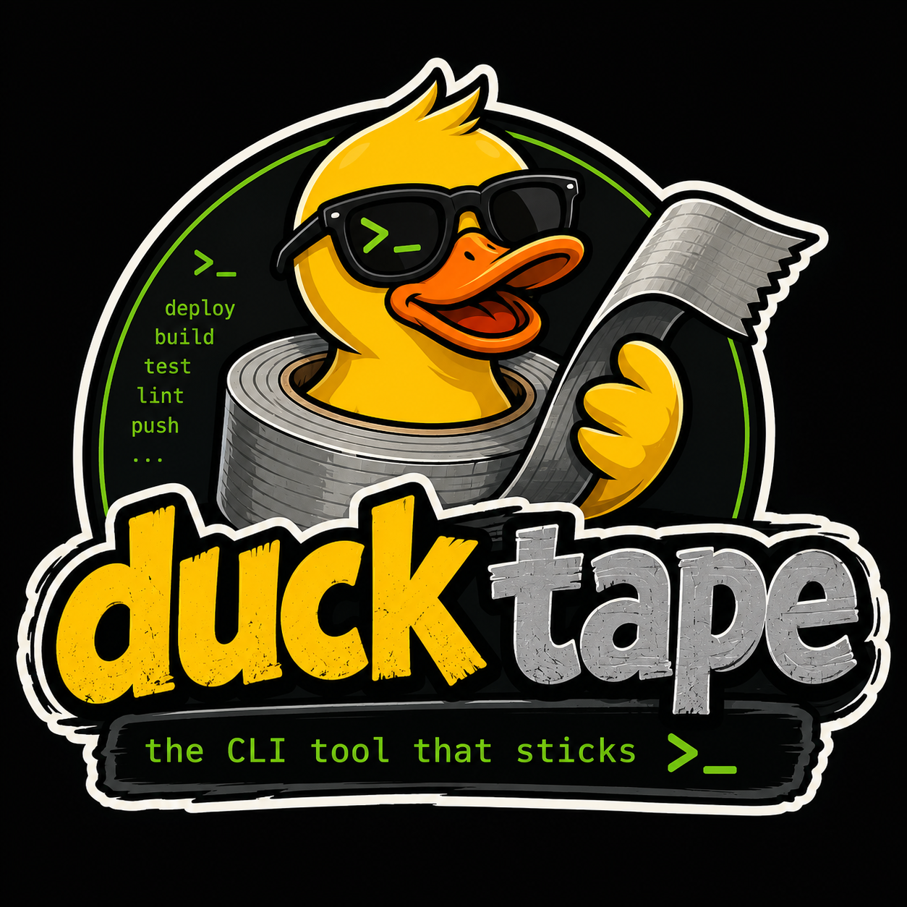
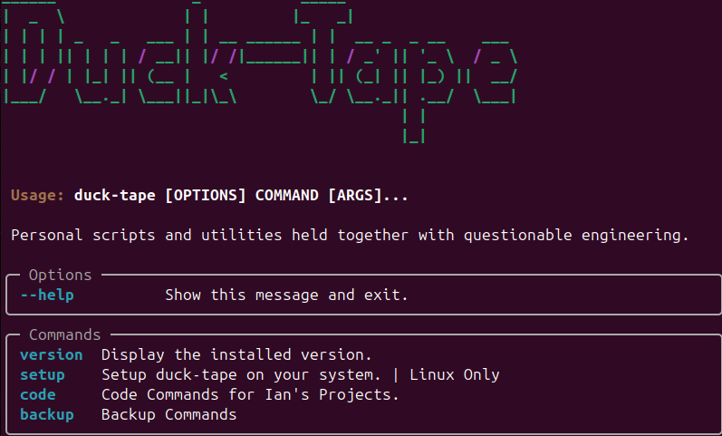

## Duck-Tape





## This Repo is for personal CLI scripts to ease development

# Getting Started

## Install dependencies

```bash
poetry install
```

## Install Git hooks

```bash
poetry run pre-commit install
```

---

# Development

Run the CLI:

```bash
poetry run duck-tape
```

Run the test suite:

```bash
poetry run pytest
```

Run linting:

```bash
poetry run ruff check .
```

Format the project:

```bash
poetry run ruff format .
```

Run all pre-commit hooks:

```bash
poetry run pre-commit run --all-files
```

## Setup Executable

```bas
poetry run duck-tape setup
```
